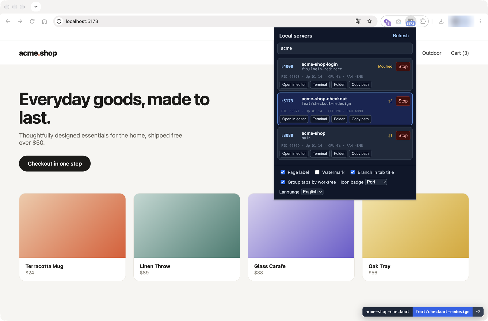
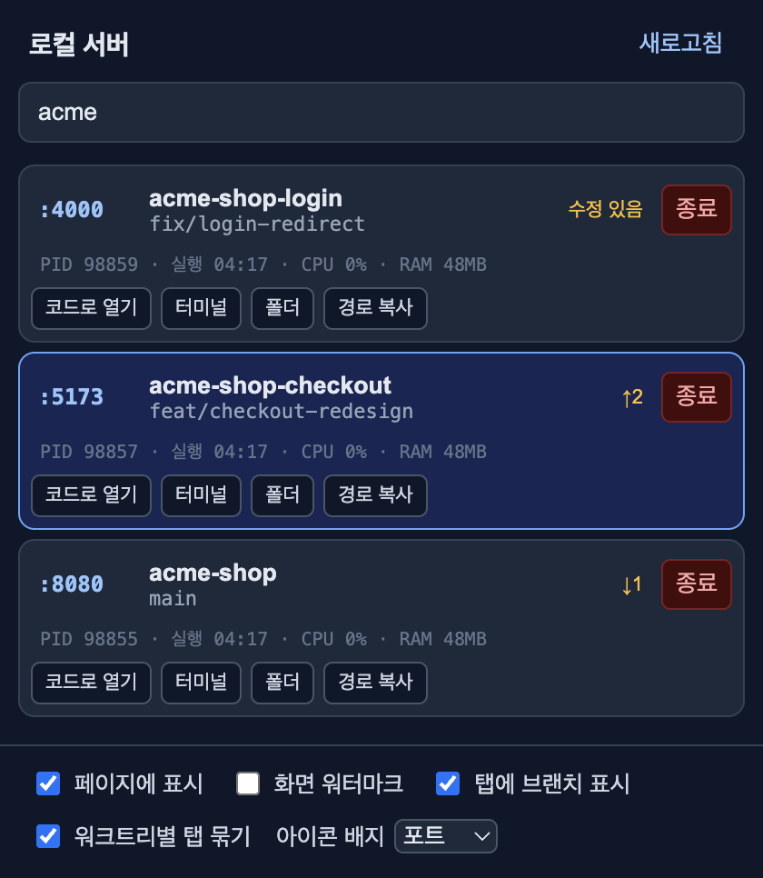
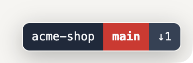
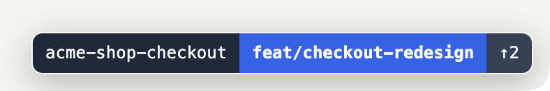
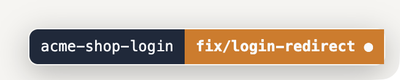

# Branchport

Branchport is a Chrome extension for macOS, Linux, and Windows that shows which Git worktree and branch is serving each localhost port.

It adds a small label to localhost pages, prefixes tab titles with the current branch, groups tabs by worktree, and provides a popup for inspecting and managing local development servers.

<p align="center">
  
</p>

## Features

<table>
  <tr>
    <td width="58%" valign="top">

- Shows the repository, worktree, branch, dirty state, commit, and upstream divergence
- Lists localhost servers with PID, uptime, CPU, and memory usage
- Groups Chrome tabs by worktree and warns about duplicate servers
- Opens a server folder in Cursor or VS Code, Terminal, or Finder
- Stops a server only after revalidating its port and PID
- Reduces background work with request coalescing, short-lived caching, and visibility-aware polling

</td>
    <td width="42%" valign="top">
      
    </td>
  </tr>
</table>

## Requirements

- macOS, Linux, or Windows
- Google Chrome
- Node.js 20 or newer
- `git`
- macOS: `lsof`
- Linux: `ss` (recommended) or `lsof`
- Windows: PowerShell 5.1 or newer

## Install

```bash
npx branchport install
```

This copies the helper to `~/.branchport` (Windows: `%LOCALAPPDATA%\Branchport`) and registers it as a background service. Run `npx branchport uninstall` to remove it.

Then install the extension:

1. Open `chrome://extensions`.
2. Enable **Developer mode**.
3. Select **Load unpacked**.
4. Clone this repository and choose its `extension` directory.

The manifest public key keeps the extension ID fixed at `gclkmofklkhonlkneebngbdiblebeekk`, allowing the helper to accept requests only from Branchport. Reload existing localhost tabs after installation.

## Usage

Open any `localhost` or `127.0.0.1` page. The page label shows the worktree and branch; clicking it copies the working directory.

The popup lists every detected Git-backed localhost server. Its settings control the page label, watermark, title prefix, automatic tab grouping, toolbar badge, and language. The language defaults to Chrome's UI language (English or Korean).

- `●`: uncommitted changes
- `↑2`: two commits ahead of upstream
- `↓1`: one commit behind upstream
- Red: `main`, `master`, or `production`
- Orange: dirty state, `fix/*`, or `hotfix/*`
- Blue: `feat/*` or `feature/*`

<table>
  <tr>
    <td align="center"></td>
    <td align="center"></td>
    <td align="center"></td>
  </tr>
  <tr>
    <td align="center"><code>main</code> · <code>↓1</code></td>
    <td align="center"><code>feat/*</code> · <code>↑2</code></td>
    <td align="center"><code>fix/*</code> · <code>●</code></td>
  </tr>
</table>

The popup shortcut can be configured at `chrome://extensions/shortcuts`. The suggested shortcut is `Control+Shift+L`.

## Helper commands

```bash
pnpm start            # Run the helper in the foreground
pnpm helper:install   # Install or update the helper service from this checkout
pnpm helper:uninstall # Remove the helper service
pnpm test             # Run unit tests
pnpm package:extension # Build the Chrome Web Store zip in dist/
```

## How it works

The helper binds only to `127.0.0.1:32190`. It uses `lsof` to map listening ports to processes, reads each process's working directory, and queries Git without modifying the detected project.

Visible tabs refresh every 5 seconds and hidden tabs every 30 seconds. Concurrent requests for the same port share one lookup, while full server scans reuse process and Git results with bounded concurrency.

All data and actions stay on the local machine. The helper exposes only `/health` publicly; repository and process endpoints require the fixed Branchport Chrome extension origin and request token.

## Platform support

- macOS uses `lsof` and installs a LaunchAgent.
- Linux uses `/proc` plus `ss` or `lsof` and installs a systemd user service.
- Windows uses `Get-NetTCPConnection` and `Win32_Process` and installs a per-user scheduled task.

## Limitations

- Servers running outside a Git worktree are not listed.
- A server whose listening process has a different working directory may not be detected.
- Windows does not expose another process's current working directory through `Win32_Process`; Branchport validates absolute paths found in the listening process and up to eight parent command lines. Servers launched without a project path in that chain may not be detected.
- The helper port is currently fixed at `32190` in both the helper and extension.

## License

No license has been granted yet.
