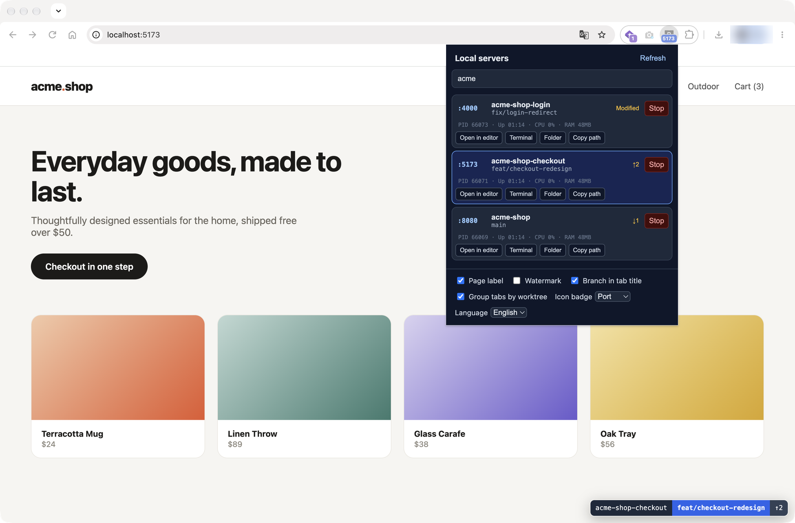
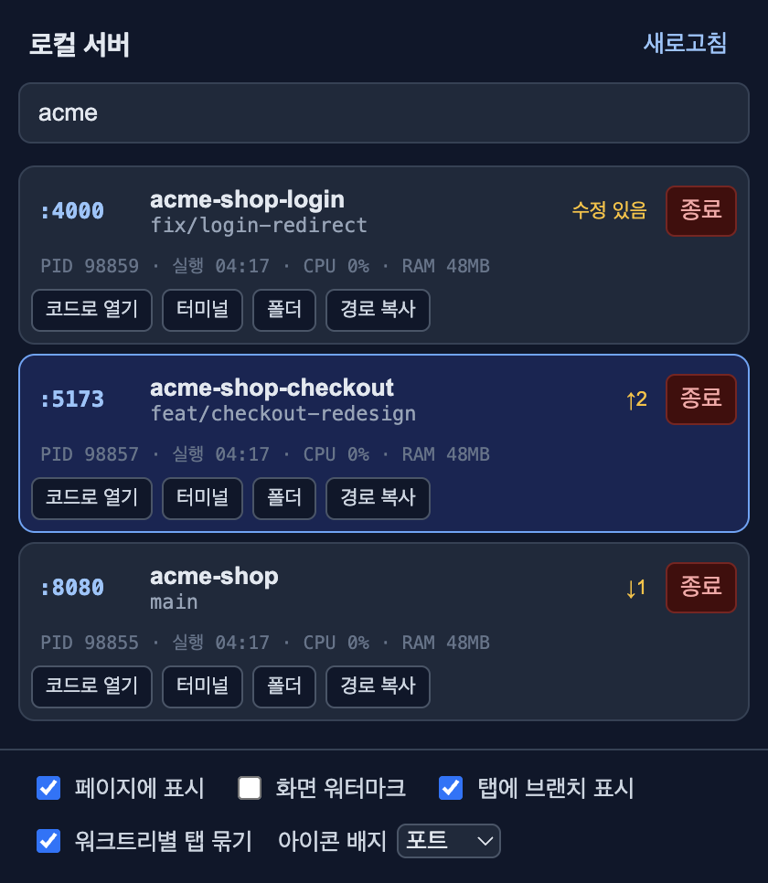
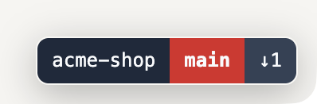
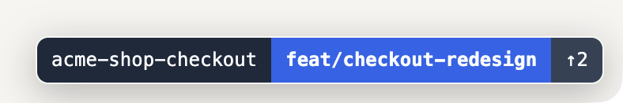
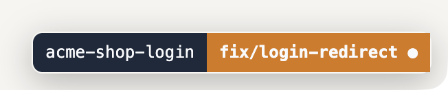

# Branchport

Branchport is a Chrome extension for macOS, Linux, and Windows that shows which Git worktree and branch is serving each localhost port.

It adds a small label to localhost pages, prefixes tab titles with the current branch, groups tabs by worktree, and provides a popup for inspecting and managing local development servers.

## 한국어

`localhost:3000`만 보고 지금 보는 화면이 어느 Git 브랜치에서 뜬 건지 헷갈린 적이 있다면 Branchport가 그 맥락을 브라우저에 바로 표시합니다.

Branchport는 localhost 페이지에 현재 repository, worktree, branch, dirty state를 작은 라벨로 붙여주는 Chrome 확장입니다. 여러 worktree와 브랜치를 동시에 띄워 개발할 때 "이 탭, 어느 브랜치지?"를 바로 확인할 수 있습니다.

<p align="center">
  
</p>

## Features

<table>
  <tr>
    <td width="58%" valign="top">

- Shows the repository, worktree, branch, dirty state, commit, and upstream divergence
- Lists localhost servers with PID, uptime, CPU, and memory usage
- Recognizes Docker Compose containers and tells apart the worktrees that started them, marked with a docker tag (can be turned off in the popup)
- Groups Chrome tabs by worktree and warns about duplicate servers
- Opens a server folder in Cursor or VS Code, Terminal, or Finder
- Stops a server only after revalidating its port and PID (Docker containers are never stopped)
- Reduces background work with request coalescing, short-lived caching, and visibility-aware polling

</td>
    <td width="42%" valign="top">
      
    </td>
  </tr>
</table>

## Requirements

- macOS, Linux, or Windows
- Google Chrome
- Node.js 20 or newer
- `git`
- macOS: `lsof`
- Optional: the `docker` CLI, to detect Docker Compose containers
- Linux: `ss` (recommended) or `lsof`
- Windows: PowerShell 5.1 or newer

## Install

1. Add Branchport from the [Chrome Web Store](https://chromewebstore.google.com/detail/branchport/lcfgllcanfffllgdbalehgdafanohngb).
2. Install the local helper:

```bash
npx branchport install
```

This copies the helper to `~/.branchport` (Windows: `%LOCALAPPDATA%\Branchport`) and registers it as a background service. Run `npx branchport uninstall` to remove it.

The extension updates itself, but the helper does not. Run the same `npx branchport install` command to update the helper; the popup tells you when it is out of date.

Reload existing localhost tabs after installation.

### Developing the extension

To run the extension from a checkout instead, open `chrome://extensions`, enable **Developer mode**, select **Load unpacked**, and choose the repository's `extension` directory. The manifest public key keeps the unpacked extension ID fixed at `gclkmofklkhonlkneebngbdiblebeekk`. The helper accepts requests only from that ID and the Chrome Web Store ID, `lcfgllcanfffllgdbalehgdafanohngb`.

## Usage

Open any `localhost` or `127.0.0.1` page. The page label shows the worktree and branch; clicking it copies the working directory.

The popup lists every detected Git-backed localhost server. Its settings control the page label, watermark, title prefix, automatic tab grouping, Docker container detection, toolbar badge, and language. The language defaults to Chrome's UI language (English or Korean).

- `●`: uncommitted changes
- `↑2`: two commits ahead of upstream
- `↓1`: one commit behind upstream
- Red: `main`, `master`, or `production`
- Orange: dirty state, `fix/*`, or `hotfix/*`
- Blue: `feat/*` or `feature/*`

<table>
  <tr>
    <td align="center"></td>
    <td align="center"></td>
    <td align="center"></td>
  </tr>
  <tr>
    <td align="center"><code>main</code> · <code>↓1</code></td>
    <td align="center"><code>feat/*</code> · <code>↑2</code></td>
    <td align="center"><code>fix/*</code> · <code>●</code></td>
  </tr>
</table>

The popup shortcut can be configured at `chrome://extensions/shortcuts`. The suggested shortcut is `Control+Shift+L`.

## Helper commands

```bash
pnpm start            # Run the helper in the foreground
pnpm helper:install   # Install or update the helper service from this checkout
pnpm helper:uninstall # Remove the helper service
pnpm test             # Run unit tests
pnpm package:extension # Build the Chrome Web Store zip in dist/
```

List detected servers from the terminal. This reads ports and Git directly, so it works even when the helper service is not installed or running:

```bash
npx branchport ls             # Table of PORT, BRANCH, STATUS, WORKTREE, PID, UPTIME
npx branchport ls 5173        # Details for one port (exits 1 if nothing is listening)
npx branchport ls --json      # Raw data for scripts; combine with a port for one object
```

Colors follow the label rules above and are disabled when output is not a terminal or `NO_COLOR` is set. The helper's own port is never listed. Docker Compose ports show `docker:<service>` in the PID column, and their details list the container, service, and image instead of process metrics.

## How it works

The helper binds only to `127.0.0.1:32190`. It uses `lsof` to map listening ports to processes, reads each process's working directory, and queries Git without modifying the detected project.

When a port belongs to Docker (`docker-proxy` on Linux, Docker Desktop's `com.docker.backend` on macOS and Windows) or no Git worktree is found for its process, the helper asks Docker instead. One `docker ps` and one `docker inspect` per scan map published host ports to containers, and the Compose label `com.docker.compose.project.working_dir` supplies the worktree. Docker servers show the container, Compose service, and uptime instead of PID, CPU, and memory, and cannot be stopped from the popup. If the Docker CLI is missing or the daemon is not running, this step is skipped. Turning off **Docker containers** in the popup settings skips it as well, so the helper never runs `docker`.

Visible tabs refresh every 5 seconds and hidden tabs every 30 seconds. Concurrent requests for the same port share one lookup, while full server scans reuse process and Git results with bounded concurrency.

All data and actions stay on the local machine. The helper exposes only `/health` publicly; repository and process endpoints require the fixed Branchport Chrome extension origin and request token.

## Platform support

- macOS uses `lsof` and installs a LaunchAgent.
- Linux uses `/proc` plus `ss` or `lsof` and installs a systemd user service.
- Windows uses `Get-NetTCPConnection` and `Win32_Process` and installs a per-user scheduled task.

## Limitations

- Servers running outside a Git worktree are not listed.
- A server whose listening process has a different working directory may not be detected.
- Windows does not expose another process's current working directory through `Win32_Process`; Branchport validates absolute paths found in the listening process and up to eight parent command lines. Servers launched without a project path in that chain may not be detected.
- Docker containers are detected only when started with Docker Compose. Containers started with `docker run` have no `com.docker.compose.project.working_dir` label and are not listed.
- A Compose container is attributed to the directory `docker compose up` ran in, so a compose file in a subdirectory shows that subdirectory as the worktree name.
- Linux with Docker's userland proxy disabled (`"userland-proxy": false`) publishes ports without a listening process, so those containers are not listed.
- Other container runtimes that expose a Docker-compatible CLI may work but are not tested.
- The helper port is currently fixed at `32190` in both the helper and extension.

## License

Branchport is released under the [MIT License](LICENSE).
